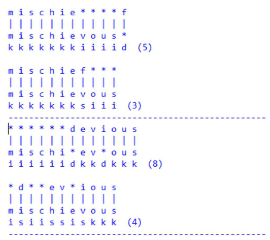

# Minimum Edit Distance
A python program that constructs the minimum cost table (using dynamic programming). It is enhanced with backtracing "pointers" to output edit operations.
### Inputs

The input consists of sets of words (one set per line in ***lowercase***) for which the mininmum edit distance should be calculated. The first word in each line is the ***target*** word. All other words in the line are source words that must be transformed to the target word (using the minimum edit distance algorithm). The input file must be named ***words.txt***. Two additional files are provided (in the same format):

* _***costs.csv***_ - a comma-delimited file containing the Levenshtein substitution costs for lowercase alphabet
* _***costs2.csv***_ - a comma-delimited file containing the confusion matrix substitution costs 

### Processing

The processing steps include:
* The cost of insertions and deletions is 1 in all cases. Substitution costs will be read from input files.
* For each pair of source and target words, the minimum edit distance is calculated (using both Levenshtein
and confusion matrix costs), and the cost and backtrace of operations are in the output.
* The dynamic programming table is complete. The backtrace table  captures all
possible sources for the minimum cost at each cell.
* When constructing the backtrace, any one of the possible cells that provide the
minimum cost to the cell being processed is randomly selected. This is  done by importing the random module, and
ensuring that all possibilities have an equal probability of being selected.

### Output
For each pair of source and target words, the program displays the following output
* 4 lines for each of the cost methods (Levenshtein and confusion matrix)
  1. Line 1 shows the ***source*** word
  2. Line 2 contains a vertical bar ("|") for each operation (one per character)
  3. Line 3 shows the ***target*** word
  4. Line 4 show the operations for each character.  Letter k (for keep) is used to indicate a null substitution (rather than a space).
* A line of 50 hyphens should be used to separate the pair of words from the next pair

See example output below;

